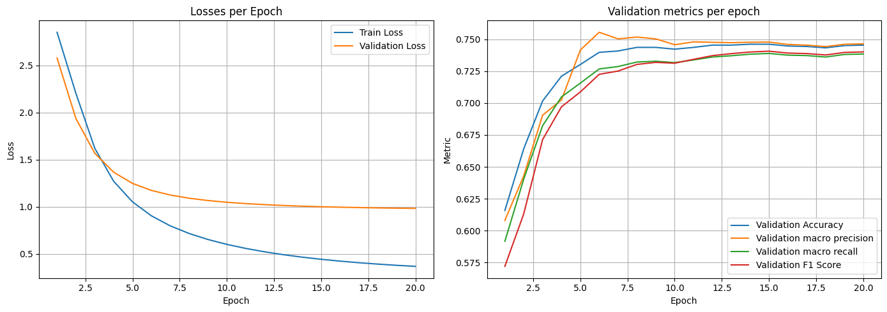
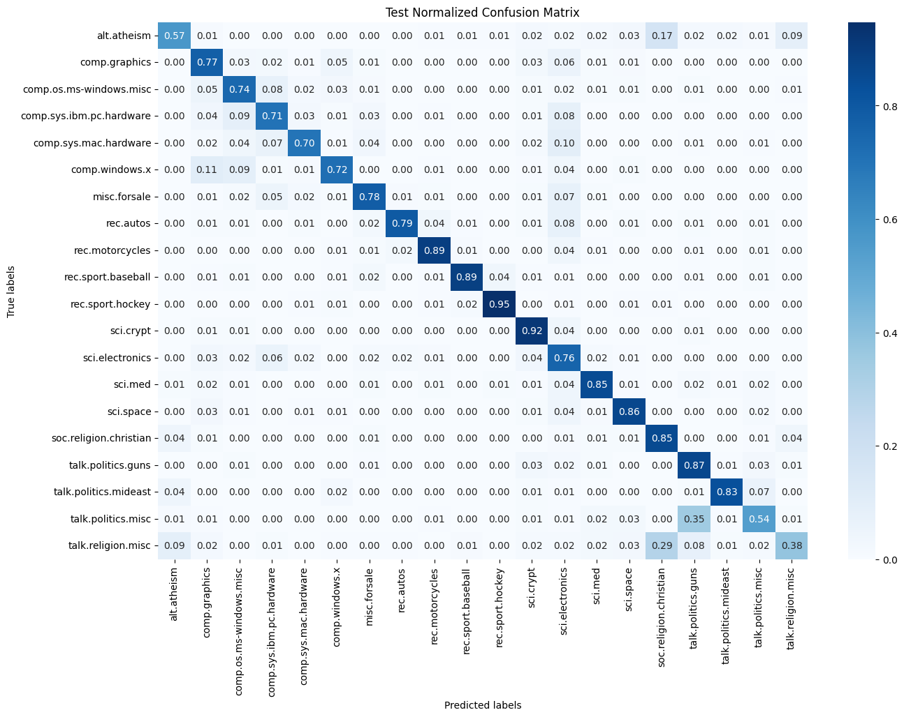

# General description
This repository contains a code for performing pdf document classification using the model pretrained using the `20 Newsgroups` dataset ([link](https://www.kaggle.com/datasets/crawford/20-newsgroups/data)).

# Getting started

## Model
This repository contains pretrained pytorch model, which was obtained using jupyter notebook `notebooks/model_training_experiments.ipynb` and tf-idf vectorizer for preprocessing an input data. All related files are stored in `models` folder.
For more information about model metrics you can find in the last chapter.

## Preparing environment
1. Use (or install) Python>=3.11.4
2. Install all required libraries using the file `requirements.txt` in the root folder of the project:
```bash
pip install -r requirements.txt 
```
3. Run tests by using `pytest` in the terminal to make sure that everything works correctly:
```bash
pytest
```
4. Configure pipeline parameters using `config.yaml` file in the root folder of the project:
   - Set `max_pages` parameter either to -1 to process all pages of the input file or any positive number to process that amount of pages if you want to increase the speed of the processing and lower memory consumption.
   - Set paths to models files if you want to use non-default models. By default, pretrained models are stored in the `models/` folder.

## Processing the PDF file
To classify a PDF file with any of `20 Newsgroups` classes, run the script `main.py`:
```bash
python main.py [-c --config_path] [-p --pdf_file_path]
```

`Flag -c: optional`, a path to config file to use. By default, file `config.yaml` in the root folder of the project is used. </br>
`Flag -p: required`, a path to PDF file to process. </br>

For example:
```bash
python main.py -p data/72052.pdf
```

As a result, in the terminal you will see the message like `Class name for the provided file is 'sci.electronics'`. For documents which cant be classified, the class will be `unknown`.

# Classification training report
You can check best training experiment and some other experiments in the notebook `notebooks/model_training_experiments.ipynb`.

Model used for inferencing here is the simple feedforward model with one hidden layer with the dimension of 128.

## Dataset description
For training, validating and testing dataset version from the `scikit-learn` is used (https://scikit-learn.org/stable/modules/generated/sklearn.datasets.fetch_20newsgroups.html#sklearn.datasets.fetch_20newsgroups). Precisely, the split remained unchanged and headers, footers and quotes are removed to make the task as close to real as possible using this dataset.
The size of splits are the following:

| Train | Val  | Test |
|-------|------|------|
| 8485  | 2829 | 7532 |

Dataset contains 20 classes with the following names:
1. alt.atheism  
2. comp.graphics  
3. comp.os.ms-windows.misc  
4. comp.sys.ibm.pc.hardware  
5. comp.sys.mac.hardware  
6. comp.windows.x  
7. misc.forsale  
8. rec.autos  
9. rec.motorcycles  
10. rec.sport.baseball  
11. rec.sport.hockey  
12. sci.crypt  
13. sci.electronics  
14. sci.med  
15. sci.space  
16. soc.religion.christian  
17. talk.politics.guns  
18. talk.politics.mideast  
19. talk.politics.misc  
20. talk.religion.misc

## Data cleaning

Data cleaning steps:
- Turning to lowecase
- Removing line splitters, links, numbers, emails and punctuation
- Removing english stop words

## Vectorizing method

For vectorizing the dataset TF-IDF with the following manual parameters is used:

| max_df | min_df | stop_words |
|--------|--------|------------|
| 0.5    | 2.0    | "english"  |

As a result, the size of vocabulary obtained from the training split is 25013.

## Training results

Training parameters are the following:

| Learning rate | Weight decay | Epochs num | Batch size | Optimizer | Loss func        |
|---------------|--------------|------------|------------|-----------|------------------|
| 0.0003        | 0.0005       | 20         | 16         | Adam      | CrossEntropyLoss |

Metrics per epoch:


Validation and test sets metrics:

|            | Accuracy | Macro Precision | Macro Recall | Macro F1 |
|------------|----------|-----------------|--------------|----------|
| Validation | 0.7455   | 0.7465          | 0.7385       | 0.7402   |
| Test       | 0.7811   | 0.7859          | 0.7692       | 0.7715   |

Normalized confusion matrices:





